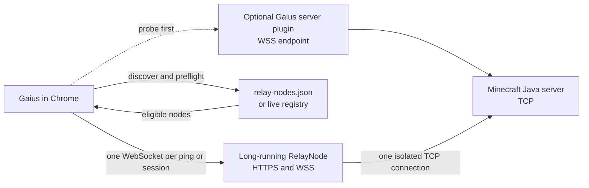

# Gaius Client

**English** | [简体中文](README.zh-CN.md)

Gaius Client `0.0.2` is an experimental browser port of Minecraft Java
Edition `26.2`, with the `1.21.11` profile retained for compatibility. Each
profile uses the original Java client path with TeaVM and browser-specific
platform overlays; this is not a TypeScript recreation of Minecraft gameplay.

**Status:** experimental public release. The downloadable client is intended
for evaluation and local single-player use. Browser, server, resource-pack,
world-generation, rendering, and performance compatibility are not guaranteed.
Use a current Chrome or Chromium browser for the primary target experience.

Gaius is independent software and is not affiliated with, endorsed by, or
operated by Mojang Studios, Microsoft, or Minecraft. Minecraft and related
marks are the property of their respective owners. Required attribution and
provenance information remains in the source and documentation. Review the
[Minecraft EULA](https://www.minecraft.net/en-us/eula),
[Minecraft Usage Guidelines](https://www.minecraft.net/en-us/usage-guidelines),
and the [feasibility and licensing notes](docs/feasibility.md) before using or
redistributing generated client files or game assets.

## Screenshots

These are runtime captures of the client UI and gameplay flows. The files are
kept under `docs/images/` so the public README remains reviewable without
opening the generated browser bundle.


## Download

The `v0.0.2` release page contains one portable browser client per supported
profile and the optional Paper plugin:

- [Download the Minecraft 26.2 client (`Gaius-26.2.html`)](https://github.com/TypeThe0ry/Gaius/releases/download/v0.0.2/Gaius-26.2.html)
- [Download the retained Minecraft 1.21.11 client (`Gaius-1.21.11.html`)](https://github.com/TypeThe0ry/Gaius/releases/download/v0.0.2/Gaius-1.21.11.html)
- [Download the optional Paper plugin](https://github.com/TypeThe0ry/Gaius/releases/download/v0.0.2/gaius-server-plugin-0.0.2.jar)
- [Download `SHA256SUMS`](https://github.com/TypeThe0ry/Gaius/releases/download/v0.0.2/SHA256SUMS)
- [Open the `v0.0.2` release page](https://github.com/TypeThe0ry/Gaius/releases/tag/v0.0.2)

Each `Gaius-<profile>.html` is a frontend-only single-player package. It can be
downloaded and opened locally in Chrome; it does not require a Gaius-hosted web
server for single-player. Multiplayer still requires either a compatible
server-side Gaius plugin or a reachable RelayNode.

## Browser Quick Start

1. Download the client for the Minecraft profile of the server you want to
   join (`Gaius-26.2.html` for the primary profile, or `Gaius-1.21.11.html`).
2. Open it in Chrome or Chromium. Allow audio after the first user gesture if
   the browser requests permission.
3. Enter a player name before joining a world or server.
4. Select **Singleplayer** for the browser-local integrated server, or open
   **Multiplayer** and enter a Java server address.

For a source checkout, the normal development launcher is served over HTTP:

```sh
python3 port/scripts/serve-dist.py --host 127.0.0.1 --port 8781
```

Open <http://127.0.0.1:8781/dist/26.2/> (or `/dist/1.21.11/`) in Chrome after
building the corresponding profile. Do not open generated `/dist/<profile>/`
files from an arbitrary path and assume that every browser security policy will
behave the same as an HTTP origin.

## Current Features

- Minecraft Java Edition `26.2` and retained `1.21.11` client paths compiled to
  the browser with TeaVM.
- WebGL rendering and browser Web Audio integration through the Gaius browser
  platform layer.
- Browser-local single-player with the integrated server running in a Worker.
- IndexedDB-backed local world storage, with client and server communication
  over a `MessageChannel`.
- Profile-scoped portable `Gaius.html` outputs (published as
  `Gaius-<profile>.html`) containing the browser launcher and generated runtime
  payloads.
- Multiplayer status and join routing through a WebSocket-to-TCP RelayNode.
- Optional Paper plugin for a server-side WebSocket endpoint.
- Git LFS tracking for the generated browser release and smoke bundles, so the
  source and runnable release stay in one repository.

## Multiplayer Routing and RelayNode

A browser cannot open the raw TCP socket required by a Minecraft Java server.
Gaius therefore carries each Minecraft byte stream over WebSocket to either an
optional server plugin or a long-running RelayNode. The RelayNode opens the TCP
side of that same stream.



### Selection and Handshake

When a player enters a normal Java server address such as
`play.example.net`, Gaius performs the following steps automatically:

1. Normalize the entered host and port, while retaining the original host for
   the Minecraft handshake.
2. Probe the optional same-host Gaius/Paper plugin endpoint. A working plugin
   provides the shortest route and removes the external RelayNode hop.
3. If the plugin is absent, read configured and public nodes from the embedded
   registry snapshot, the curated [`relay-nodes.json`](relay-nodes.json), and
   any configured live registries. Discovery is bounded and duplicate or cyclic
   entries are ignored.
4. Query each candidate's `/relay-node/v1?host=...&port=...` manifest. Gaius
   ranks nodes using an existing active route to the target, recent
   reachability, available capacity, and configured priority.
5. Open `wss://<relay>/tunnel` and send a small `connect` control message with
   the requested host and port. The RelayNode checks the browser Origin, access
   token when configured, destination policy, capacity, DNS, and public-network
   restrictions.
6. Resolve Minecraft SRV records when applicable, open the target TCP socket,
   and return `connecting` followed by `connected` with target attestation.
   Binary WebSocket frames then carry the Minecraft stream in both directions.

If one node cannot reach the target, the client advances to the next eligible
node. A successful status ping creates short-lived target affinity so the
subsequent Join action can prefer the same RelayNode without reusing the ping's
network stream.

### What the Relay Translates

RelayNode is a transport bridge between browser WebSocket frames and a Java
server TCP stream. It is not a general Minecraft protocol-version translator:
the client and destination server must still agree on a compatible protocol.
Most game bytes are forwarded unchanged. Encrypted online-mode traffic remains
opaque to the RelayNode. For supported unencrypted `1.21.11` and `26.2` flows,
narrowly scoped keepalive, configuration-reentry, and resource-pack proxy
behavior can prevent browser reload stalls without turning the node into a game
server.

Every server-list status ping, login attempt, reconnect, and player session has
its own WebSocket and its own TCP socket. Multiple players may select the same
RelayNode, but their protocol streams are never shared or multiplexed into one
Minecraft connection.

### Service and Tunnel Lifetime

The RelayNode process is the always-on service. It should run behind an HTTPS
and WSS reverse proxy and use an operating-system or container restart policy.
The target-specific tunnel is temporary:

1. Opening a status ping or Join action acquires one WebSocket-scoped tunnel
   lease and one TCP connection.
2. Closing the browser channel, leaving the server, failing the connection, or
   losing the WebSocket immediately cancels the TCP dial or destroys the TCP
   socket.
3. After the last player leaves, the RelayNode remains online. Only bounded,
   expiring reachability metadata may remain for future node selection.

Consequently, `activeConnections: 0` on `/health` means the node is ready but
currently idle. It does not mean the RelayNode service is stopped. Keeping a
single permanent TCP connection to a Minecraft target would be incorrect
because every player connection has independent handshake, authentication,
compression, encryption, configuration, and play state.

### Security and Compatibility Boundaries

The downloadable `file://` client sends `Origin: null`; a public node must list
`null` in `GAIUS_ALLOWED_ORIGINS` if it intends to serve portable clients.
Hosted clients should use explicit HTTPS origins. Public RelayNodes should deny
private, loopback, link-local, and otherwise restricted destination addresses,
even when their public host policy accepts arbitrary Minecraft domains.

A RelayNode cannot bypass the destination server's version, authentication,
allow-list, proxy, firewall, resource-pack, or online-mode requirements. The
node must be able to resolve and reach the target, and no arbitrary server is
guaranteed to work. Traffic passes through the selected operator's machine, so
operators are responsible for TLS, origin and destination policy, capacity,
rate limits, abuse handling, traffic accounting, logs, and privacy.

The optional Paper plugin is installed beside a Java server and removes the
external RelayNode hop for that server. It is not required for the normal
RelayNode route. See the [RelayNode registry guide](docs/relay-nodes.md),
[`apps/bridge/README.md`](apps/bridge/README.md), and the
[`apps/server-plugin/README.md`](apps/server-plugin/README.md) plugin guide.

## Single-Player Architecture

The downloadable client keeps the game frontend and integrated server in the
player's browser:

```text
Chrome tab <-> MessageChannel <-> integrated-server Worker <-> IndexedDB
```

The Worker owns server ticks, world generation, and local-world persistence.
The browser render/input side receives server packets through the channel and
uses the browser platform overlays for graphics, timing, audio, storage, and
network boundaries. This architecture avoids requiring a hosted Gaius backend
for single-player, but it does not remove the CPU and memory limits of the
player's browser tab.

## Repository Map

| Path | Purpose |
| --- | --- |
| `port/` | TeaVM port, browser overlays, bytecode patchers, build scripts, and launcher |
| `port/web/` | Browser launcher, Worker bootstrap, smoke pages, and generated release input |
| `port/web/dist/<profile>/` | Profile-scoped generated client, Worker, Wasm, compressed payloads, and portable `Gaius.html` |
| `apps/bridge/` | Self-hostable RelayNode, registry process, routing logic, and smoke tests |
| `apps/server-plugin/` | Optional Paper plugin for a server-side Gaius endpoint |
| `packages/` | Checked-in browser protocol and local-world support modules |
| `docs/` | Architecture, feasibility, performance, RelayNode, audit, and release notes |
| `tools/` | Repository validation scripts, including Git LFS and registry checks |
| `relay-nodes.json` | Curated public RelayNode registry bootstrap |

Generated browser artifacts are intentionally kept with the source through Git
LFS. Mojang client JARs, mappings, libraries, assets, local worlds, secrets,
`port/target/`, and Maven build output are not source files and must remain
local.

## Build From Source

Requirements: JDK 21 for the retained `1.21.11` profile and JDK 25 or newer
for the primary `26.2` profile, plus a current Node.js LTS release, Python 3,
`curl`, `jq`, `unzip`, `shasum`, and Git LFS. The build defaults to a 14 GiB
Java heap; 24 GiB or more of physical memory is recommended, with memory-heavy
apps closed.

Acquire the local-only Minecraft inputs and build both profile releases. The
wrapper selects profile-scoped `port/target/<profile>`, `port/work/overlays/<profile>`,
and `port/web/dist/<profile>` roots and selects the required JDK:

```sh
git lfs install
git lfs pull
for profile in 1.21.11 26.2; do
  export GAIUS_VERSION_PROFILE_PATH="versions/${profile}.json"
  ./port/scripts/fetch-version.sh
  ./port/scripts/remap-client.sh
  bash port/scripts/build-version-release.sh "$profile"
done
```

The generated portable clients are `port/web/dist/<profile>/Gaius.html`. Never
hand-edit files in `port/web/dist/`; rebuild them from the launcher and platform
source. More TeaVM details are in [`port/README.md`](port/README.md).

## Tests and Checks

After the profile builds above, run the profile-scoped artifact checks relevant
to the code you changed:

```sh
for profile in 1.21.11 26.2; do
  export GAIUS_VERSION_PROFILE_PATH="versions/${profile}.json"
  export GAIUS_BUILD_ROOT="port/target/${profile}"
  export GAIUS_OVERLAY_DIRECTORY="port/work/overlays/${profile}"
  export GAIUS_DIST_DIRECTORY="port/web/dist/${profile}"
  python3 port/scripts/quick-check.py
  node port/scripts/singleplayer-worker-runtime-smoke.mjs
done
git diff --check
```

RelayNode changes should also run:

```sh
for profile in 1.21.11 26.2; do
  GAIUS_SMOKE_MINECRAFT_VERSION="$profile" npm run smoke --prefix apps/bridge
done
npm run smoke:profiles --prefix apps/bridge
for profile in 1.21.11 26.2; do
  GAIUS_PUBLIC_RELAY_MINECRAFT_VERSION="$profile" npm run smoke:public --prefix apps/bridge
done
```

Paper plugin changes should run:

```sh
GAIUS_VERSION_PROFILE_PATH=versions/1.21.11.json \
  ./port/mvnw -B -ntp -f apps/server-plugin/pom.xml test
```

Static checks do not replace a Chrome runtime check. For rendering, input,
audio, world generation, and chunk-loading changes, enter a real world, move
through newly loaded terrain, and record the browser and server behavior.

## Known Limitations

- This is an experimental browser port, not a compatibility promise for every
  Chrome version, device, Java server, proxy, mod, plugin, resource pack, or
  network topology.
- Single-player world generation and newly loaded chunks can be CPU-intensive
  in a browser Worker. Large or complex worlds may cause visible frame-time
  spikes or slow initial loading.
- The portable HTML is frontend-only. It cannot start a RelayNode on another
  computer; multiplayer needs a reachable public/private RelayNode or a
  server-side plugin endpoint.
- A RelayNode does not make offline, firewalled, private-network, incompatible,
  or otherwise unreachable Java servers accessible.
- Browser security policies, autoplay restrictions, WebGL limits, memory
  pressure, and tab suspension can affect rendering, sound, latency, and
  stability.
- The generated client and game assets remain subject to provenance,
  entitlement, redistribution, and platform-policy review. This repository is
  independent software and does not grant rights to Mojang-owned material.

## Contributing

Read [`CONTRIBUTING.md`](CONTRIBUTING.md) before opening a pull request. Keep
browser-visible behavior changes close to their platform source, include the
exact checks you ran, and attach a concise Chrome runtime result for rendering,
input, audio, loading, or networking work. Install Git LFS before changing the
checked-in browser release:

```sh
git lfs install
git lfs pull
./tools/check-lfs.sh
```

The [RelayNode documentation](docs/relay-nodes.md),
[release guide](docs/releasing.md), and
[TeaVM platform-gap notes](docs/teavm-platform-gap.md) describe the current
boundaries and open engineering work.

## Security

Report security issues privately through the repository's
[GitHub Security page](https://github.com/TypeThe0ry/Gaius/security). Do
not publish bridge tokens, private server addresses, session data, or
credentials in issues or pull requests. Relay operators must treat a public
node as an exposed network service and configure TLS, origin checks,
destination policy, rate limits, capacity limits, logging, and abuse contact
information.

## License and Attribution

Gaius is independent software. This repository does not by itself grant a
license to redistribute Mojang/Microsoft client code, mappings, libraries,
assets, or generated game artifacts. Preserve all upstream notices and review
the [Minecraft EULA](https://www.minecraft.net/en-us/eula),
[Usage Guidelines](https://www.minecraft.net/en-us/usage-guidelines), and
[official 1.21.11 release information](https://www.minecraft.net/en-us/article/minecraft-java-edition-1-21-11).
For project-level licensing and attribution review, see the
[feasibility notes](docs/feasibility.md) and the
[GitHub repository](https://github.com/TypeThe0ry/Gaius).

## Release Documentation

- [Release guide](docs/releasing.md)
- [RelayNode registry guide](docs/relay-nodes.md)
- [Performance targets](docs/performance-targets.md)
- [Platform-gap notes](docs/teavm-platform-gap.md)
