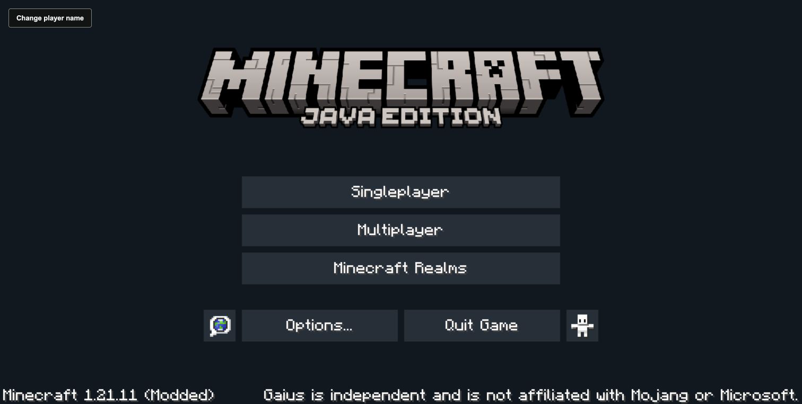
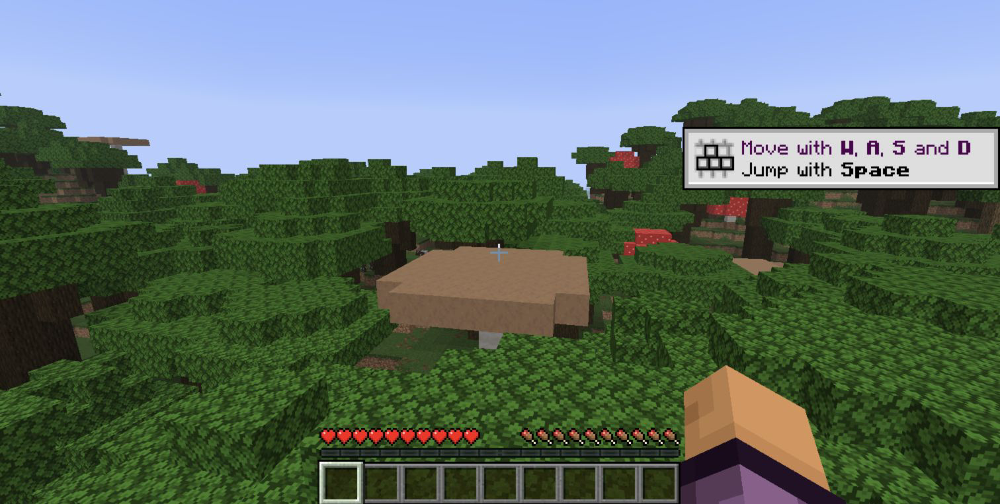
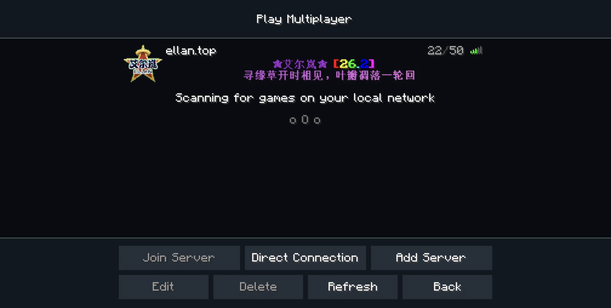
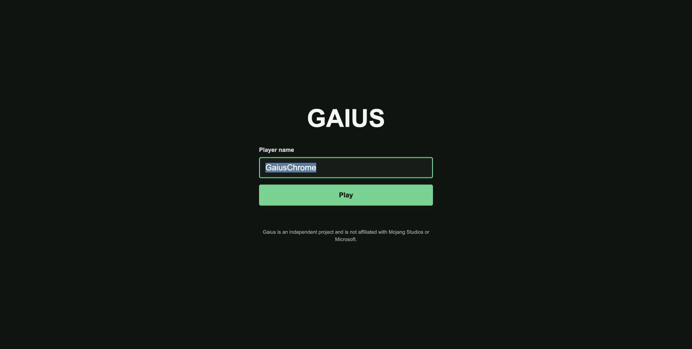
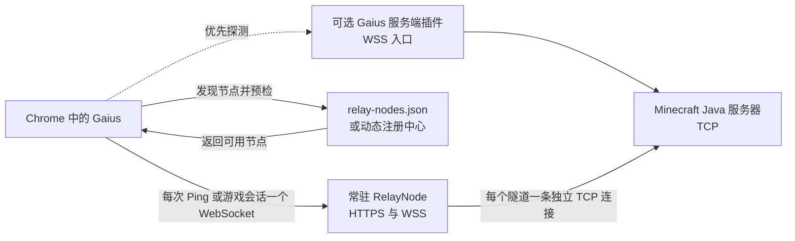

# Gaius Client

[English](README.md) | **简体中文**

Gaius Client `0.0.3` 是 Minecraft Java Edition `26.2` 的实验性浏览器移植，
同时保留 `1.21.11` 兼容 profile。每个 profile 都通过 TeaVM 和浏览器平台覆盖层
运行原始 Java 客户端路径，并不是使用 TypeScript 重新实现 Minecraft 游戏逻辑。

**当前状态：** 实验性公开版本。可下载客户端主要用于评估和本地单人游戏。
浏览器、服务器、资源包、世界生成、渲染和性能兼容性目前均不作保证。
推荐使用最新版 Chrome 或 Chromium 浏览器。

Gaius 是独立软件，与 Mojang Studios、Microsoft 或 Minecraft 没有隶属、
授权、认可或运营关系。Minecraft 及相关商标归其各自权利人所有。必要的归属和
来源信息保留在源码与文档中。使用或分发生成的客户端文件及游戏资源前，请阅读
[Minecraft EULA](https://www.minecraft.net/en-us/eula)、
[Minecraft 使用准则](https://www.minecraft.net/en-us/usage-guidelines)以及
[可行性与许可说明](docs/feasibility.md)。

## 实际截图

以下图片来自客户端 UI 和实际游戏流程。截图保存在 `docs/images/`，便于在不打开
大型浏览器构建产物的情况下直接查看项目效果。









## 下载

`v0.0.3` Release 页面为每个支持的 profile 提供可移植浏览器客户端和可选的
Paper 插件：

- [下载 Minecraft 26.2 客户端（`Gaius-26.2.html`）](https://github.com/TypeThe0ry/Gaius/releases/download/v0.0.3/Gaius-26.2.html)
- [下载保留的 Minecraft 1.21.11 客户端（`Gaius-1.21.11.html`）](https://github.com/TypeThe0ry/Gaius/releases/download/v0.0.3/Gaius-1.21.11.html)
- [下载可选 Paper 插件](https://github.com/TypeThe0ry/Gaius/releases/download/v0.0.3/gaius-server-plugin-0.0.3.jar)
- [下载 `SHA256SUMS`](https://github.com/TypeThe0ry/Gaius/releases/download/v0.0.3/SHA256SUMS)
- [打开 `v0.0.3` Release 页面](https://github.com/TypeThe0ry/Gaius/releases/tag/v0.0.3)

每个 `Gaius-<profile>.html` 都是前端独立的单人游戏包。下载后可以直接在 Chrome
中打开，单人模式不需要由 Gaius 托管网页服务器。多人模式仍需要兼容的 Gaius
服务端插件，或者一个浏览器可以访问的 RelayNode。

## 浏览器快速开始

1. 根据要连接的服务器 profile，从上方 Release 下载客户端（主 profile 使用
   `Gaius-26.2.html`，兼容版本使用 `Gaius-1.21.11.html`）。
2. 使用 Chrome 或 Chromium 打开。首次操作后，如果浏览器请求音频权限，请允许
   播放声音。
3. 在进入世界或服务器前输入玩家名称。
4. 选择 **Singleplayer** 启动浏览器本地集成服务器，或者进入
   **Multiplayer** 并输入 Java 服务器地址。

源码检出的开发版本通常通过 HTTP 启动：

```sh
python3 port/scripts/serve-dist.py --host 127.0.0.1 --port 8781
```

构建对应 profile 后，在 Chrome 中打开 <http://127.0.0.1:8781/dist/26.2/>（或
`/dist/1.21.11/`）。不要从任意目录直接打开 `/dist/<profile>/` 文件，并假设所有
浏览器安全策略都与 HTTP Origin 完全一致。

## 当前功能

- 使用 TeaVM 将 Minecraft Java Edition `26.2` 和保留的 `1.21.11` 客户端路径编译到浏览器。
- 通过 Gaius 浏览器平台层提供 WebGL 渲染和 Web Audio 音频。
- 单人游戏的集成服务器运行在浏览器 Worker 中。
- 本地世界保存在 IndexedDB，客户端与服务器通过 `MessageChannel` 通信。
- 按 profile 生成的 `Gaius.html`（发布时命名为 `Gaius-<profile>.html`）包含浏览器启动器和所需运行时数据。
- 多人服务器状态查询和加入流程可经过 WebSocket 到 TCP 的 RelayNode。
- 提供可选 Paper 插件，为服务器提供直接 WebSocket 入口。
- 使用 Git LFS 保存浏览器 Release 和 Smoke 构建产物，使源码与可运行版本位于同一仓库。

## 多人路由与 RelayNode 原理

浏览器无法直接建立 Minecraft Java 服务器所需的原始 TCP Socket。因此，Gaius
把每条 Minecraft 字节流通过 WebSocket 发送到可选的服务端插件或常驻
RelayNode，再由它们建立对应的 TCP 连接。



### 选路与握手

玩家输入普通 Java 服务器地址，例如 `play.example.net` 后，Gaius 会自动执行：

1. 规范化输入的主机名和端口，同时保留原始主机名用于 Minecraft 握手。
2. 探测目标主机上的可选 Gaius/Paper 插件入口。插件可用时采用最短路径，不再经过
   外部 RelayNode。
3. 插件不存在时，从当前 profile 的 `Gaius-<profile>.html` 内嵌注册表快照、仓库维护的
   [`relay-nodes.json`](relay-nodes.json)以及用户配置的动态注册中心中发现公共或
   私有节点。发现数量受到限制，重复和循环注册表会被忽略。
4. 请求每个候选节点的 `/relay-node/v1?host=...&port=...` 清单。客户端根据节点是否
   已有到目标的活动路由、最近是否成功访问目标、剩余容量和配置优先级进行排序。
5. 连接 `wss://<relay>/tunnel`，发送只包含目标主机和端口的 `connect` 控制消息。
   RelayNode 检查浏览器 Origin、可选访问令牌、目标策略、容量、DNS 结果以及
   公网地址限制。
6. 必要时解析 Minecraft SRV 记录，然后建立目标 TCP Socket。节点先返回
   `connecting`，连接成功后返回带目标证明的 `connected`。此后，Minecraft 数据
   通过二进制 WebSocket 帧双向传输。

如果一个节点无法到达目标，客户端会自动尝试下一个候选节点。服务器列表 Ping
成功后会留下短时间的目标亲和信息，因此正式点击 Join 时可以优先选择同一个
RelayNode，但不会复用 Ping 的网络连接。

### “转译”的准确含义

RelayNode 是浏览器 WebSocket 帧与 Java 服务器 TCP 字节流之间的传输桥接器，
不是通用的 Minecraft 协议版本转换器。客户端和目标服务器仍必须使用兼容的协议
版本。大部分游戏数据保持原样转发，在线模式加密后的数据对 RelayNode 不透明。

对于支持的未加密 `1.21.11` 和 `26.2` 流程，RelayNode 可以在浏览器长时间重载
资源包期间执行范围严格受限的 Keepalive、配置阶段重入和资源包代理逻辑，避免服务
器因浏览器主线程暂停而超时。这些功能不会把 RelayNode 变成游戏服务器，也不会对
普通游戏包进行全面重写。

服务器列表状态 Ping、登录尝试、重连和每个玩家会话，都拥有独立的 WebSocket 和
独立的 TCP Socket。多个玩家可以选择同一个 RelayNode，但它们的 Minecraft 协议流
不会共享，也不会被合并成一条 Minecraft 连接。

### 服务与隧道生命周期

RelayNode 进程是需要一直运行的常驻服务。公共节点应位于 HTTPS/WSS 反向代理后，
并配置操作系统服务或容器自动重启策略。具体目标服务器的隧道则是临时的：

1. 每次状态 Ping 或 Join 都会申请一个以 WebSocket 为生命周期的隧道租约，并建立
   一条 TCP 连接。
2. 浏览器关闭通道、玩家离开服务器、连接失败或 WebSocket 中断时，RelayNode 会
   立即取消尚未完成的 TCP 连接，或者销毁已经连接的 TCP Socket。
3. 最后一名玩家退出后，RelayNode 仍保持在线。节点最多保留有数量和有效期限制的
   目标可达性元数据，用于下一次选路。

因此，`/health` 返回 `activeConnections: 0` 表示节点在线且当前空闲，不表示
RelayNode 服务已经停止。不能为所有玩家长期保持并复用一条到 Minecraft 服务器的
TCP 连接，因为每个玩家都有独立的握手、身份验证、压缩、加密、配置和游戏状态。

### 安全与兼容边界

下载后通过 `file://` 打开的客户端会发送 `Origin: null`。如果公共节点需要支持
可移植 HTML，必须在 `GAIUS_ALLOWED_ORIGINS` 中明确允许 `null`。在线托管的客户端
应配置明确的 HTTPS Origin。公共 RelayNode 即使允许任意公共 Minecraft 域名，也
应拒绝私有、Loopback、Link-local 和其他受限目标地址。

RelayNode 无法绕过目标服务器的版本、身份验证、白名单、代理、防火墙、资源包或
在线模式要求。节点必须能够解析并访问目标服务器，不能保证任意 Java 服务器都可用。
数据会经过所选节点运营者的机器，因此运营者必须负责 TLS、Origin 与目标策略、容量、
限速、滥用处理、流量统计、日志和隐私。

可选 Paper 插件安装在 Java 服务器旁边，可移除该服务器到外部 RelayNode 的一跳。
普通 RelayNode 路径不要求安装插件。更多资料见
[RelayNode 注册表指南](docs/relay-nodes.md)、
[`apps/bridge/README.md`](apps/bridge/README.md)和
[`apps/server-plugin/README.md`](apps/server-plugin/README.md)。

## 单人游戏架构

可下载客户端把游戏前端和集成服务器都保留在玩家浏览器中：

```text
Chrome 标签页 <-> MessageChannel <-> 集成服务器 Worker <-> IndexedDB
```

Worker 负责服务器 Tick、世界生成和本地世界持久化。浏览器的渲染与输入侧通过通道
接收服务器数据包，并通过浏览器平台覆盖层获得图形、计时、音频、存储和网络能力。
该架构使单人模式不需要托管 Gaius 后端，但无法消除浏览器标签页自身的 CPU 和内存
限制。

## 仓库结构

| 路径 | 用途 |
| --- | --- |
| `port/` | TeaVM 移植、浏览器覆盖层、字节码 Patcher、构建脚本和启动器 |
| `port/web/` | 浏览器启动器、Worker Bootstrap、Smoke 页面和 Release 输入 |
| `port/web/dist/<profile>/` | 按 profile 生成的客户端、Worker、Wasm、压缩数据和可移植 `Gaius.html` |
| `apps/bridge/` | 可自行部署的 RelayNode、注册中心、路由逻辑和 Smoke 测试 |
| `apps/server-plugin/` | 提供服务端 Gaius 入口的可选 Paper 插件 |
| `packages/` | 纳入版本控制的浏览器协议和本地世界支持模块 |
| `docs/` | 架构、可行性、性能、RelayNode、审计和 Release 文档 |
| `tools/` | 仓库验证脚本，包括 Git LFS 和注册表检查 |
| `relay-nodes.json` | 公共 RelayNode 发现所使用的初始注册表 |

生成的浏览器产物通过 Git LFS 与源码一起保存。Mojang 客户端 JAR、Mappings、依赖库、
游戏资源、本地世界、密钥、`port/target/` 和 Maven 构建输出不是项目源码，必须保留在
本地且不能提交。

## 从源码构建

依赖：保留的 `1.21.11` profile 需要 JDK 21，主 profile `26.2` 需要 JDK 25 或更高
版本，另需当前 Node.js LTS、Python 3、`curl`、`jq`、`unzip`、`shasum` 和 Git LFS。
默认构建使用 14 GiB Java Heap，建议物理内存不低于 24 GiB，并在构建时关闭占用大量
内存的应用。

获取仅存放在本机的 Minecraft 输入，然后构建两个 profile 的浏览器 Release。包装器会
自动使用 `port/target/<profile>`、`port/work/overlays/<profile>` 和
`port/web/dist/<profile>`，并选择所需的 JDK：

```sh
git lfs install
git lfs pull
for profile in 1.21.11 26.2; do
  export GAIUS_VERSION_PROFILE_PATH="versions/${profile}.json"
  ./port/scripts/fetch-version.sh
  ./port/scripts/remap-client.sh
  bash port/scripts/build-version-release.sh "$profile"
done
```

生成的可移植客户端位于 `port/web/dist/<profile>/Gaius.html`。不要手工修改
`port/web/dist/` 中的文件，应从启动器和平台源码重新构建。更多 TeaVM 说明见
[`port/README.md`](port/README.md)。

## 测试与检查

完成上面的 profile 构建后，应运行与改动范围相匹配的 profile 产物检查：

```sh
for profile in 1.21.11 26.2; do
  export GAIUS_VERSION_PROFILE_PATH="versions/${profile}.json"
  export GAIUS_BUILD_ROOT="port/target/${profile}"
  export GAIUS_OVERLAY_DIRECTORY="port/work/overlays/${profile}"
  export GAIUS_DIST_DIRECTORY="port/web/dist/${profile}"
  python3 port/scripts/quick-check.py
  node port/scripts/singleplayer-worker-runtime-smoke.mjs
done
git diff --check
```

修改 RelayNode 后还应运行：

```sh
for profile in 1.21.11 26.2; do
  GAIUS_SMOKE_MINECRAFT_VERSION="$profile" npm run smoke --prefix apps/bridge
done
npm run smoke:profiles --prefix apps/bridge
for profile in 1.21.11 26.2; do
  GAIUS_PUBLIC_RELAY_MINECRAFT_VERSION="$profile" npm run smoke:public --prefix apps/bridge
done
```

修改 Paper 插件后应运行：

```sh
GAIUS_VERSION_PROFILE_PATH=versions/1.21.11.json \
  ./port/mvnw -B -ntp -f apps/server-plugin/pom.xml test
```

静态检查不能代替 Chrome 运行时验证。修改渲染、输入、音频、世界生成或区块加载后，
必须进入实际世界，移动到新地形，并记录浏览器与服务器行为。

## 已知限制

- 本项目是实验性浏览器移植，不保证兼容所有 Chrome 版本、设备、Java 服务器、代理、
  Mod、插件、资源包或网络拓扑。
- 浏览器 Worker 中的单人世界生成和新区块加载会占用大量 CPU。大型或复杂世界可能
  出现明显的帧时间尖峰或较慢的初次加载。
- 可移植 HTML 只有前端，无法在另一台机器上凭空启动 RelayNode。多人游戏需要已有的
  公共或私有 RelayNode，或者服务端插件入口。
- RelayNode 无法让离线、被防火墙阻止、位于私有网络、协议不兼容或本来不可访问的
  Java 服务器变得可用。
- 浏览器安全策略、自动播放限制、WebGL 限制、内存压力和标签页挂起会影响渲染、
  声音、延迟与稳定性。
- 生成的客户端和游戏资源仍需进行来源、授权、再分发和平台政策审查。本仓库是独立
  软件，不授予分发 Mojang 所有材料的权利。

## 参与贡献

提交 Pull Request 前请阅读 [`CONTRIBUTING.md`](CONTRIBUTING.md)。浏览器可见行为的
修改应尽量靠近所属平台源码，说明运行过的准确检查，并为渲染、输入、音频、加载或
网络改动附上简明的 Chrome 运行结果。修改纳入仓库的浏览器 Release 前，请先安装
Git LFS：

```sh
git lfs install
git lfs pull
./tools/check-lfs.sh
```

[RelayNode 文档](docs/relay-nodes.md)、[Release 指南](docs/releasing.md)和
[TeaVM 平台差距说明](docs/teavm-platform-gap.md)记录了当前边界与待完成工程工作。

## 安全

请通过仓库的 [GitHub Security 页面](https://github.com/TypeThe0ry/Gaius/security)
私下报告安全问题。不要在 Issue 或 Pull Request 中发布 Bridge Token、私有服务器
地址、会话数据或凭据。公共节点属于暴露在互联网中的网络服务，运营者必须配置 TLS、
Origin 检查、目标策略、限速、容量限制、日志和滥用联系信息。

## 许可与归属

Gaius 是独立软件。本仓库本身不授予重新分发 Mojang/Microsoft 客户端代码、Mappings、
依赖库、资源或生成游戏产物的许可。请保留所有上游声明，并阅读
[Minecraft EULA](https://www.minecraft.net/en-us/eula)、
[使用准则](https://www.minecraft.net/en-us/usage-guidelines)和
[官方 1.21.11 发布信息](https://www.minecraft.net/en-us/article/minecraft-java-edition-1-21-11)。
项目级许可与归属审查见[可行性说明](docs/feasibility.md)和
[GitHub 仓库](https://github.com/TypeThe0ry/Gaius)。

## Release 文档

- [Release 指南](docs/releasing.md)
- [RelayNode 注册表指南](docs/relay-nodes.md)
- [性能目标](docs/performance-targets.md)
- [平台差距说明](docs/teavm-platform-gap.md)
