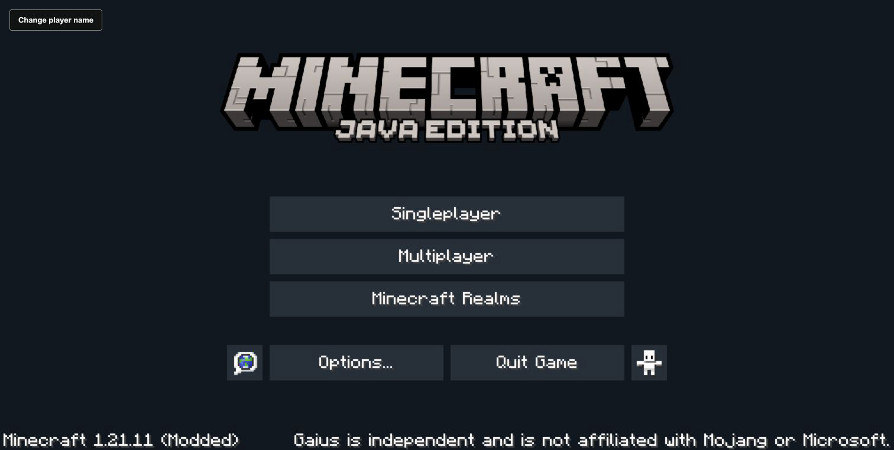
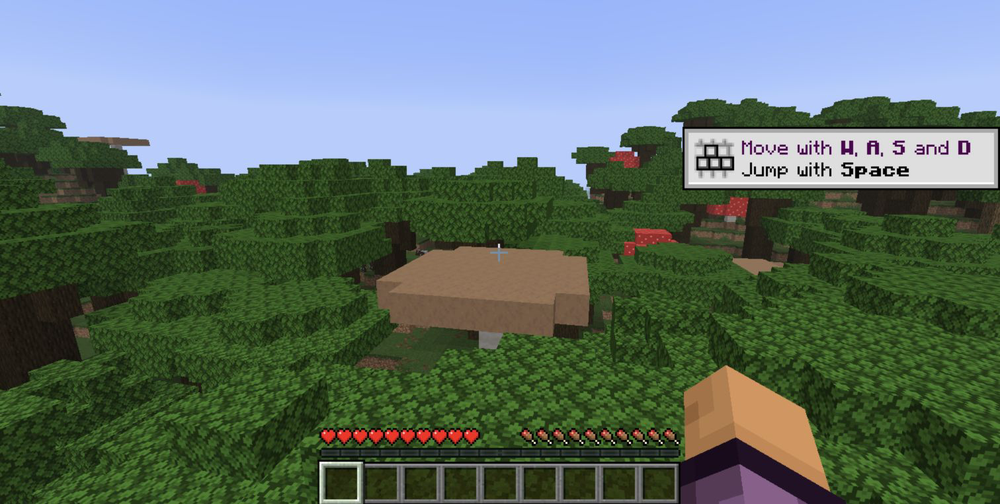
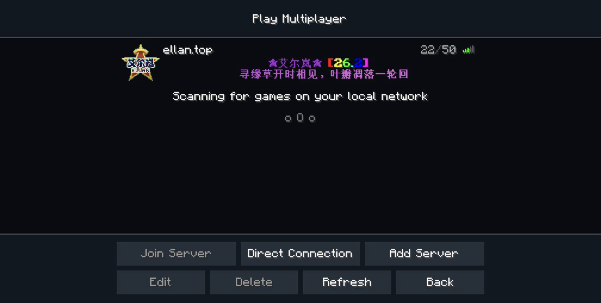
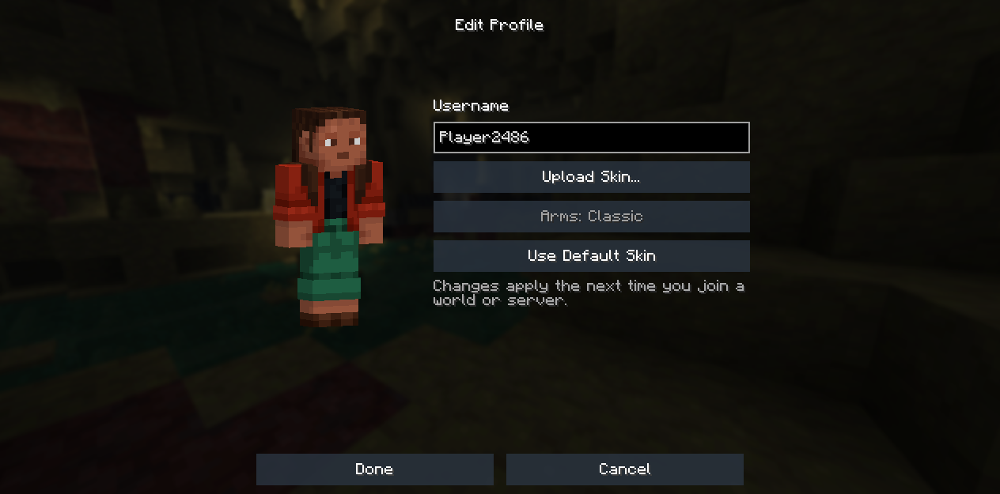

# Gaius Client

[English](README.md) | **简体中文**

Gaius 让 Minecraft Java 版客户端直接在浏览器里运行。它不是重写版：官方客户端的
字节码由 TeaVM 编译成 JavaScript，浏览器无法提供的 Java 能力（窗口、OpenGL、
OpenAL、Socket、文件系统）则换成浏览器实现。

> **非 Minecraft 官方产品，未经 Mojang 或 Microsoft 批准，与其无关联。**
> 本项目有相当一部分内容借助 AI 编程助手完成。使用或分发前，请先阅读
> [AI 使用说明](#ai-使用说明)和[免责声明](#免责声明)。

- **单个标签页即可单人游戏。** 集成服务器运行在客户端旁边的 Web Worker 中，
  世界存档保存在浏览器存储里。发布包只是一个 HTML 文件，不需要任何 Gaius 服务。
- **可以连接普通 Java 版服务器。** 浏览器通过 WebSocket-to-TCP 的 RelayNode
  或可选的 Gaius Paper 插件连接服务器，服务器本身无需改动。
- **支持三个游戏版本。** Minecraft 1.21.11、26.2 和 26.3，每个版本单独构建一个客户端。

## 截图









## 下载与游玩

从[最新 Release](https://github.com/TypeThe0ry/Gaius/releases/latest) 下载与目标服务器
Minecraft 版本一致的 HTML 文件：

| 文件                                                                                                     | Minecraft 版本                                                         |
| -------------------------------------------------------------------------------------------------------- | ---------------------------------------------------------------------- |
| [`Gaius-1.21.11.html`](https://github.com/TypeThe0ry/Gaius/releases/latest/download/Gaius-1.21.11.html) | 1.21.11，26.x 之前的最后一个版本，适合仍停留在该版本的服务器和模组移植 |
| [`Gaius-26.2.html`](https://github.com/TypeThe0ry/Gaius/releases/latest/download/Gaius-26.2.html)       | 26.2                                                                   |
| [`Gaius-26.3.html`](https://github.com/TypeThe0ry/Gaius/releases/latest/download/Gaius-26.3.html)       | 26.3                                                                   |

校验值见 [`SHA256SUMS`](https://github.com/TypeThe0ry/Gaius/releases/latest/download/SHA256SUMS)。
可选的 Paper 插件也在同一个 Release 页面。

用新版 Chrome 或 Chromium 打开文件，点 **Singleplayer（单人游戏）** 即可。启动器和
Worker 所需内容都打包在这个文件里，不需要另外安装或启动任何东西。

26.2 和 26.3 客户端首次启动时会打开 **Edit Profile（编辑个人资料）** 界面，可以设置
玩家名称，也可以上传 64x64 的 PNG 皮肤。之后随时可以从标题界面的 **Edit Profile**
按钮再次打开，修改立即生效，无需刷新页面。1.21.11 客户端没有游戏内的个人资料编辑界面。

### 加入服务器

1. 打开与服务器版本一致的 HTML 文件。
2. 在标题界面点 **Multiplayer（多人游戏）**。
3. 点 **Add Server（添加服务器）** 或 **Direct Connection（直接连接）**，输入普通的
   Java 版服务器地址（例如 `example.net:25565`），然后点 **Join Server（加入服务器）**。

地址要填在 Minecraft 的服务器界面里，不是浏览器地址栏。浏览器无法直接建立 TCP
连接，所以目标服务器必须安装 Gaius Paper 插件，或者能通过已配置的 RelayNode 访问。
如果界面一直停在 **Waiting for Server**，请检查 RelayNode 地址和目标 `host:port`，
并确认客户端版本与服务器一致。

## 工作原理

```text
浏览器标签页
  Minecraft 客户端（TeaVM → JavaScript）
    WebGL 2 · Web Audio · 键盘与鼠标
        │
        ├── MessageChannel ── 集成服务器（Web Worker）
        │                     世界存档：IndexedDB / OPFS
        │
        └── WebSocket ── Paper 插件或 RelayNode ── TCP ── Java 版服务器
```

- **客户端。** 构建时在本地下载官方客户端 JAR，打上字节码补丁、替换部分类，
  再用 TeaVM 编译。游戏逻辑、渲染代码和网络协议都来自 Mojang 的客户端，
  Gaius 不另外维护一套世界模拟。
- **单人模式。** 官方集成服务器被编译进独立的 Web Worker。客户端与服务器通过一对
  `MessageChannel` 通信，世界数据保存在 IndexedDB 和 Origin Private File System（OPFS，
  源私有文件系统）中。
- **多人模式。** 客户端把 Minecraft 字节流通过 WebSocket 发出，由 RelayNode 或 Paper
  插件为每个玩家建立一条到目标服务器的 TCP 连接。它只负责传输，不做协议转换，
  因此客户端和服务器的版本、登录验证配置仍需一致。

构建流程和运行时的细节见 [port README](port/README.md)。

## 技术栈

| 领域                 | 技术                                                                                                                                                                       |
| -------------------- | -------------------------------------------------------------------------------------------------------------------------------------------------------------------------- |
| 游戏代码             | Minecraft Java 版官方客户端和服务端，构建时在本地下载，从不提交到仓库。1.21.11 使用 NeoForged AutoRenamingTool 按 Mojang 官方映射表重映射；26.2 和 26.3 本身就带可读名称。 |
| Java → 浏览器编译器 | [TeaVM](https://teavm.org/) 0.15（输出 JavaScript），配合打过补丁的 TeaVM core 和 TeaVM 类库 overlay                                                                        |
| 字节码补丁           | 基于[ASM](https://asm.ow2.io/) 的 patcher（`port/tools/`），替换类放在 `port/overrides/`                                                                                |
| 平台层               | 用 Java 基于 TeaVM 的 JSO 互操作实现的浏览器版 LWJGL（GLFW、OpenGL、OpenAL、STB、shaderc、SPIRV-Cross）、Netty 传输层和日志库                                              |
| 图形与音频           | WebGL 2、Web Audio API                                                                                                                                                     |
| 单人模式运行时       | Web Worker、`MessageChannel`、IndexedDB、Origin Private File System                                                                                                      |
| WebAssembly          | C 语言热路径模块（clang → wasm32），保留 JavaScript 回退实现；26.3 的着色器管线使用 Emscripten 编译的 shaderc 和 SPIRV-Cross                                              |
| 启动器与打包         | HTML/CSS/JavaScript 启动器；由 Python 生成单文件 HTML；gzip 负载在浏览器中用`DecompressionStream` 解压；HTTP 部署时提供 gzip 和 Brotli 两种压缩版本                      |
| RelayNode            | Node.js 22+、[`ws`](https://github.com/websockets/ws)；提供 Docker、nginx/Caddy、systemd 部署示例；以及一个 Cloudflare Worker 源站代理                                    |
| Paper 插件           | Java 21、Paper API 1.21.11、Java-WebSocket、Gson、JUnit 5                                                                                                                  |
| 共享包               | `packages/` 中带 TypeScript 类型声明的 JavaScript 模块                                                                                                                   |
| 构建                 | 通过仓库自带的`port/mvnw` 使用 Maven 3.9，JDK 21 和 JDK 25，Bash、Python 3、Node.js、Git LFS                                                                             |
| 测试与 CI            | Node.js 冒烟测试、Python 检查脚本、基于 Chrome DevTools Protocol 的浏览器驱动、GitHub Actions、GitHub Pages                                                                |

## 从源码构建

需要 Git LFS、Python 3、Node.js 22 或更新版本、`curl`、`jq`、`unzip`、`shasum`，以及
目标 profile 对应的 JDK：26.2 和 26.3 需要 JDK 25 或更新版本，1.21.11 需要 JDK 21 或
更新版本。完整构建客户端会使用 14 GiB 的 Java 堆，建议机器至少有 24 GiB 内存。

```sh
git lfs install
git lfs pull

for profile in 1.21.11 26.2 26.3; do
  export GAIUS_VERSION_PROFILE_PATH="versions/${profile}.json"
  ./port/scripts/fetch-version.sh
  ./port/scripts/remap-client.sh
  bash port/scripts/build-version-release.sh "$profile"
done
```

每个 profile 的 Maven 状态、overlay 和输出都分开保存。构建结果在
`port/web/dist/<profile>/`，其中的 `Gaius.html` 就是可携带的单文件客户端。26.3 的构建
还需要 WebAssembly 着色器工具链，详见 [`CONTRIBUTING.md`](CONTRIBUTING.md) 和
[Release 指南](docs/releasing.md)。

本地预览已构建的 profile：

```sh
python3 port/scripts/serve-dist.py --host 127.0.0.1 --port 8781
```

然后在 Chrome 中打开 `/dist/1.21.11/`、`/dist/26.2/` 或 `/dist/26.3/`。

## 目录结构

| 路径                         | 内容                                                   |
| ---------------------------- | ------------------------------------------------------ |
| `port/`                    | TeaVM 移植：浏览器平台代码、启动器、patcher 和构建脚本 |
| `port/web/dist/<profile>/` | 按 profile 生成的输出，不要手工编辑                    |
| `apps/bridge/`             | 可自行部署的 WebSocket-to-TCP RelayNode                |
| `apps/server-plugin/`      | 可选的 Paper 插件，在服务器端提供连接入口              |
| `packages/`                | 浏览器协议和本地世界支持代码                           |
| `docs/`                    | 设计说明、Release 说明与检查、RelayNode 指南、截图     |
| `tools/`                   | 仓库检查和发布辅助脚本                                 |

## 部署 RelayNode

RelayNode 让浏览器可以连接没有安装 Gaius 插件的 Java 版服务器。任何人都可以部署；
它不托管世界，也不运行游戏。公开节点应配置 TLS、允许的 Origin、目标地址策略、
限流与容量上限，以及问题反馈联系方式。

仓库中的传输检查从私有验收环境读取经过授权的目标和 RelayNode 地址。目标主机和
源站 IP 从不提交到仓库。

详见 [RelayNode 指南](docs/relay-nodes.md)和
[`apps/bridge/README.md`](apps/bridge/README.md)。

## 参与开发

请先阅读 [`CONTRIBUTING.md`](CONTRIBUTING.md)，其中列出了环境搭建步骤和各部分需要
运行的检查。生成的文件按 profile 分目录保存，并在 Pull Request 中写明实际运行过的
命令。不要提交 Mojang 客户端文件、本地世界、密钥或构建状态。发布流程见
[Release 指南](docs/releasing.md)。

## AI 使用说明

Gaius 的开发大量借助了 AI 编程助手，主要是 Anthropic 的 Claude（通过 Claude Code
使用）和 OpenAI 的 Codex。它们被用于：

- 编写和重构代码，包括浏览器平台层、字节码 patcher、RelayNode 和 Paper 插件；
- 编写构建、测试和发布脚本；
- 排查 bug 和性能问题；
- 审查 Pull Request；
- 编写文档，包括本 README。

项目由人类维护者主导：决定开发方向、决定合并和发布哪些内容，并对项目负责。
AI 编写的改动和其他改动走同样的流程：运行脚本检查，并在 Chrome 中实际测试构建出的客户端。

## 免责声明

- **非官方。** 非 Minecraft 官方产品，未经 Mojang 或 Microsoft 批准，与其无关联
  （NOT AN OFFICIAL MINECRAFT PRODUCT. NOT APPROVED BY OR ASSOCIATED WITH MOJANG OR
  MICROSOFT.）。Minecraft 及其代码和资源归 Mojang Studios 和 Microsoft 所有。
- **实验性项目，不提供任何担保。** Gaius 按“现状”提供，不附带任何形式的担保，
  详见[许可证](LICENSE)。它可能崩溃、与桌面版行为不一致，或丢失单人世界存档。
  清除网站数据、使用无痕窗口或浏览器回收存储空间都可能删除已保存的世界。
  不要用它保存你承受不起丢失的世界。
- **AI 生成的代码。** 借助 AI 编写的代码可能存在测试未能发现的错误，包括安全问题。
  在部署公开 RelayNode 或在重要服务器上安装 Paper 插件之前，请先审查代码。
- **使用者自负责任。** 你需要自行遵守
  [Minecraft EULA](https://www.minecraft.net/en-us/eula)、
  [使用准则](https://www.minecraft.net/en-us/usage-guidelines)以及所加入服务器的规则。
  有些服务器不允许使用非官方客户端。RelayNode 运营者需对其节点承载的流量负责。
- **再分发。** Release 中的 HTML 文件包含编译后的 Mojang 代码和游戏资源。本仓库
  不授予任何分发 Mojang 或 Microsoft 客户端代码、映射表、库、资源或生成的游戏文件的
  权利。分发之前，请先阅读[可行性与许可说明](docs/feasibility.md)。
- **不构成法律意见。** 本仓库中的任何内容均不构成法律意见。

## 许可证

Gaius 自身的源代码以 [MIT 许可证](LICENSE)发布。该许可证不涵盖 Minecraft 的代码、
映射表、库或资源，这些仍归 Mojang Studios 和 Microsoft 所有。复用代码时请保留上游声明。

安全问题请通过仓库的
[GitHub Security 页面](https://github.com/TypeThe0ry/Gaius/security)报告，
不要发公开 Issue。
