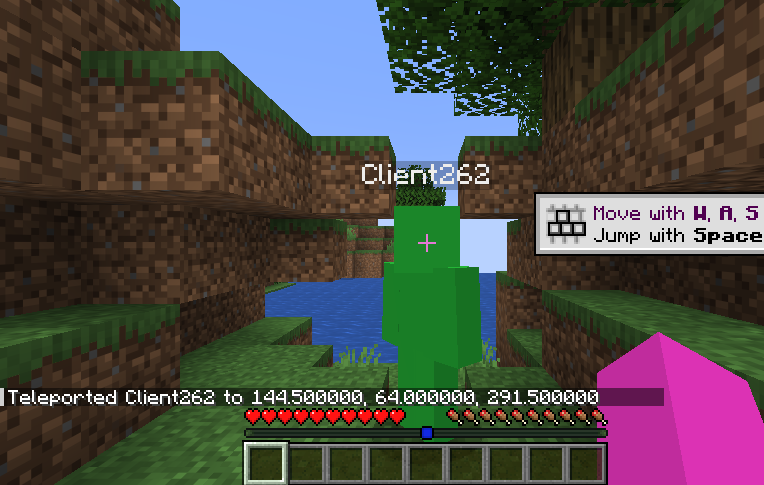
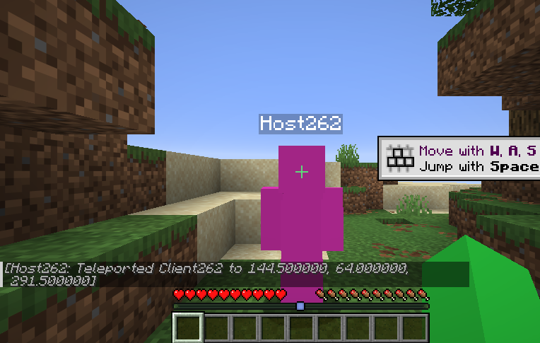

# Gaius v0.2.2

This release continues the Minecraft 26.2 browser client line. It is the first
full (non-pre-release) 0.2.x release; the 1.21.11 profile is no longer built.

## Custom skins

- **User Profile** accepts a 64×64 PNG skin. It is stored locally in the
  browser and is never uploaded anywhere except to the players you connect to.
- The skin is carried to LAN peers through the relay and rendered for every
  player in the world, not only for yourself. Remote players now render
  uploaded skins: authlib's texture-domain check accepts bounded
  `data:image/png` skins, and a lone uploaded skin (no cape or elytra) is
  treated as trusted. Every other skin URL and texture set keeps vanilla rules.
- Offline players get the vanilla name-derived UUID
  (`nameUUIDFromBytes("OfflinePlayer:" + name)`) instead of one shared
  placeholder, so a second player can join without kicking the host. Sessions
  stored by older builds are migrated automatically.

## Open to LAN from a second browser

A second browser can now join an **Open to LAN** world end to end: the LAN
server uses its own relay-only tunnel, joiners populate relay candidates again,
and RelayNode buffers the server's first login bytes until the joiner pairs.

Two browsers on one LAN world, each with its own uploaded skin (host magenta,
joiner green):

| Host sees the joiner | Joiner sees the host |
| --- | --- |
|  |  |

## Singleplayer no longer stalls on the connect screen

About one in three new singleplayer worlds in v0.2.1 never left the connect
screen. The integrated server counted a still-running finish-configuration
handler as pending input, re-ran its input task in a tight loop, and made
worldgen yield to the handler that was waiting for it. Only packets the server
can start are now treated as pending. In real Chrome, eight of eight new
worlds entered PLAY after the fix, compared with two of three before it.

## Known limitation

Creating a new world still takes about one minute before the first terrain is
visible (cold Worker start, spawn-area generation, and worldgen scheduling).
This is being worked on for the next release.

## Downloads

- `Gaius-26.2.html` — the portable browser client (open it in Chrome or
  Chromium). `Gaius-26.2.html.gz` is the same file compressed.
- `Gaius-26.2.manifest.json` — build and artifact identity.
- `gaius-server-plugin-0.2.2.jar` — the optional Paper plugin.
- `SHA256SUMS` — checksums for every asset.

No server address, source IP, or private acceptance target is embedded in this
release or its notes.
